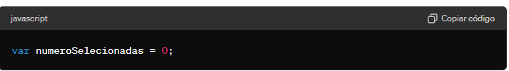

# site de musica
esse site foi criado para você escutar suas musicas favorias, tendo varios estilos de musica diferentes, tendo usado javaScript para 
estilisar e mostrar uma mensagem onde mostrara quantos tipos de musica você escolheo, tendo como nome weezer onde podera escutar suas musicas offline para poder curtir suas musicas favorias em todo momento.

# javaScript
 
 ## elementos usados 
 
 * ### function:
 O elemento function no JavaScript é usado para definir uma função. No código fornecido, ele é usado para definir a função howMany, que conta o número de opções selecionadas em um elemento select,Portanto, a função howMany é definida para calcular o número de opções selecionadas em um elemento select, e você pode chamar essa função passando o elemento select como argumento. 

 * ### var:
 O elemento var em JavaScript é usado para declarar uma variável. Vamos analisar como ele é usado no seu exemplo

Aqui, var numeroSelecionadas = 0; faz duas coisas:

 1Declaração de Variável (var numeroSelecionadas):
var: Indica que estamos declarando uma variável.
numeroSelecionadas: É o nome da variável.

2 Inicialização (= 0):
Atribui o valor inicial de 0 à variável numeroSelecionadas.
Portanto, var numeroSelecionadas = 0; cria uma variável chamada numeroSelecionadas e a inicializa com o valor 0.

* ### if:
O elemento if em JavaScript é uma estrutura de controle de fluxo que permite executar um bloco de código se uma condição especificada for verdadeira.

