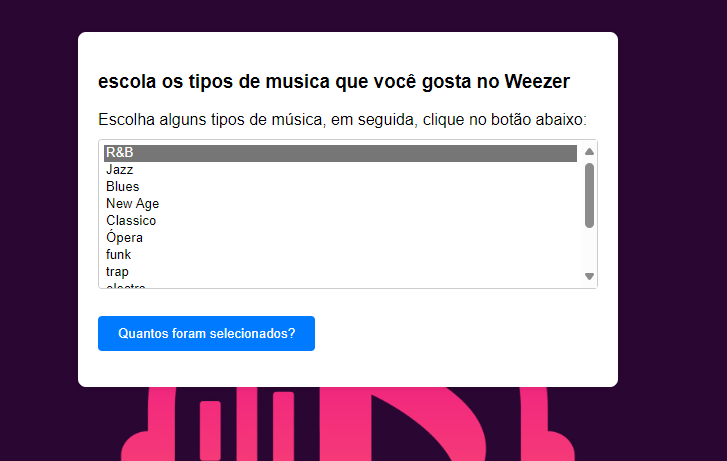
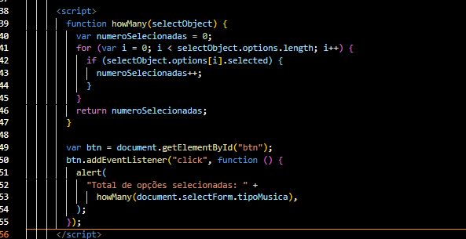

# site de musica
esse site foi criado para você escutar suas musicas favorias, tendo varios estilos de musica diferentes, tendo usado javaScript para 
estilisar e mostrar uma mensagem onde mostrara quantos tipos de musica você escolheo, tendo como nome weezer onde podera escutar suas musicas offline para poder curtir suas musicas favorias em todo momento.




# javaScript
 
 # elementos usados 
 
 * ## function:
 O elemento function no JavaScript é usado para definir uma função. No código fornecido, ele é usado para definir a função howMany, que conta o número de opções selecionadas em um elemento select,Portanto, a função howMany é definida para calcular o número de opções selecionadas em um elemento select, e você pode chamar essa função passando o elemento select como argumento. 
 ```
 function howMany(selectObject) {
 ```

 * ## var:
 O elemento var em JavaScript é usado para declarar uma variável. Vamos analisar como ele é usado no seu exemplo

 ```
var numeroSelecionadas = 0;
 ```

Aqui, var numeroSelecionadas = 0; faz duas coisas:

 1Declaração de Variável (var numeroSelecionadas):
var: Indica que estamos declarando uma variável.
numeroSelecionadas: É o nome da variável.

2 Inicialização (= 0):
Atribui o valor inicial de 0 à variável numeroSelecionadas.
Portanto, var numeroSelecionadas = 0; cria uma variável chamada numeroSelecionadas e a inicializa com o valor 0.

* ## if:
O elemento if em JavaScript é uma estrutura de controle de fluxo que permite executar um bloco de código se uma condição especificada for verdadeira.

 ```
 if (selectObject.options[i].selected) {
 ```
if: É a palavra-chave que inicia a estrutura condicional. Ela verifica se a expressão dentro dos parênteses é avaliada como verdadeira.
(selectObject.options[i].selected): É a condição que está sendo testada.
selectObject: É o objeto do elemento select passado como argumento para a função howMany.
.options[i]: Acessa a i-ésima opção dentro do elemento select.

.selected: Verifica se a opção está selecionada. Se a opção estiver selecionada, esta expressão será avaliada como verdadeira.

{}: Define o bloco de código que será executado se a condição for verdadeira.

numeroSelecionadas++;: Se a condição for verdadeira (ou seja, se a opção estiver selecionada), incrementa a variável numeroSelecionadas em 1.

Resumindo, o bloco de código dentro do if é executado apenas se a condição selectObject.options[i].selected for verdadeira, o que significa que a opção atual está selecionada. Isso é usado para contar quantas opções estão selecionadas dentro do elemento 


* ## return
O return em JavaScript é uma declaração que termina a execução de uma função e especifica o valor a ser retornado dessa função. Vamos olhar como ele é usado no exemplo:

 ``` 
 return numeroSelecionadas;
  ```
  Aqui, return é usado para:

Encerrar a execução da função: Quando o return é alcançado, a função howMany é encerrada e o controle é devolvido ao local onde a função foi chamada.

Retornar um valor: A expressão numeroSelecionadas é o valor retornado pela função. Isso significa que quando você chama a função howMany, ela retorna o número de opções selecionadas no elemento select que foi passado como argumento.

* ## btn 
No código fornecido, btn é uma variável que representa um elemento HTML com o ID "btn". Aqui está como ela é definida:

 ```
  btn.addEventListener("click", function () {
  ```
  Essa linha utiliza o método document.getElementById() para selecionar um elemento HTML pelo seu ID. O elemento selecionado é então atribuído à variável btn.

Normalmente, essa variável btn é usada para adicionar um evento de clique ao botão correspondente

* ## alert 
A função alert() em JavaScript é usada para exibir uma caixa de diálogo com uma mensagem para o usuário. No contexto do seu código, a função alert() está sendo usada para mostrar uma mensagem contendo o total de opções selecionadas em um elemento select.

 ```
  alert(
  ```
String fixa: "Total de opções selecionadas: ".
Resultado da função howMany(): O resultado da função howMany() é concatenado à string fixa para formar a mensagem completa.
Portanto, quando essa linha de código é executada, uma caixa de diálogo será exibida com a mensagem "Total de opções selecionadas: " seguida pelo número de opções selecionadas no elemento select com o nome "tipoMusica".




imagen ilustrativa.


fonte usada:

[Laço](https://developer.mozilla.org/pt-BR/docs/Web/JavaScript/Guide/Loops_and_iteration)

